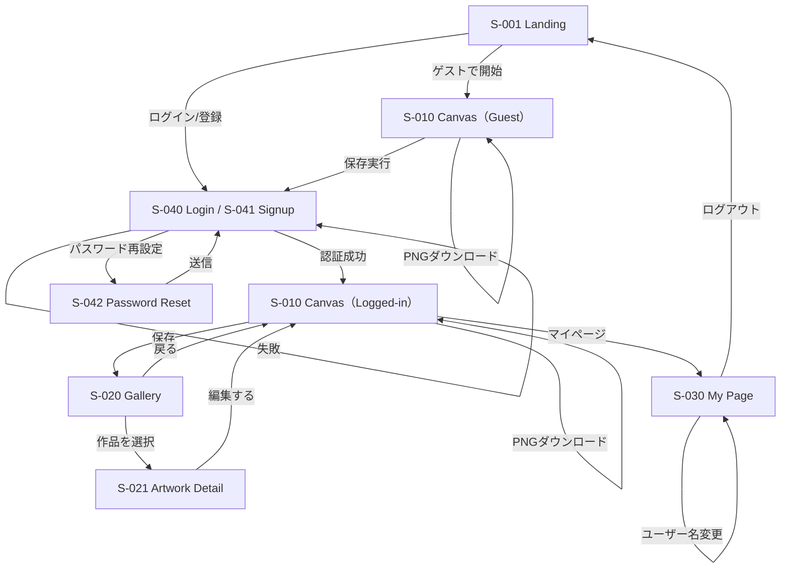

# 画面遷移仕様書（Kaleido Studio）

## 1. 目的

本書は、Kaleido Studio の画面遷移・導線・認証ガードを定義し、Figmaプロトタイプ・実装・テストの基準とすることを目的とする。

---

## 2. 画面一覧

| Screen ID | 画面名 | ルート例 | 認証 | 概要 |
|---|---|---|---|---|
| S-001 | Landing | `/` | 不要 | サービス概要、ゲスト開始、ログイン/登録導線 |
| S-010 | Canvas | `/canvas` | 不要（ゲスト可） | 描画メイン画面 |
| S-020 | Gallery | `/gallery` | 必要 | 保存作品一覧 |
| S-021 | Artwork Detail | `/artworks/:id` | 必要 | 作品詳細・編集導線 |
| S-030 | My Page | `/me` | 必要 | ユーザー名変更、ログアウト |
| S-040 | Login | `/login` or modal | 不要 | ログイン |
| S-041 | Signup | `/signup` or modal | 不要 | 新規登録 |
| S-042 | Password Reset | `/reset` | 不要 | パスワード再設定 |
| S-050 | Error | `/error` | 不要 | エラー表示 |

---

## 3. 基本遷移図



## 4. 認証ガード
  ### 4.1 認証必須画面
    - S-020 Gallery
    - S-021 Artwork Detail
    - S-030 My Page

  ### 4.2 ガード挙動
  未ログインユーザーが認証必須画面にアクセスした場合、以下のいずれかを行う。
  - Login画面へ遷移する
  - Loginモーダルを表示する

  ### 4.3 ガード例
  ```mermaid
  flowchart LR
    G[/gallery/] --> |未ログイン|L[/login/]
    D[/artworks/:id] --> |未ログイン|L
    M[/me/] --> |未ログイン|L
  ```
## 5. 画面別遷移仕様
  ### 5.1 S-001 Landing
    遷移可能先
    - S-010 Canvas（ゲスト）
    - S-040 Login
    - S-041 Signup
    備考
    - 初回訪問時の起点画面
    - サービス説明と開始導線を提供する

  ### 5.2 S-010 Canvas
  遷移可能先
  - S-020 Gallery（ログインユーザーのみ）
  - S-030 My Page
  - S-040 Login（ゲストが保存操作した場合）
  - S-001 Landing（戻る時）
  主要操作
  - 描画
  - モード切替
  - 保存
  - PNGダウンロード
  分岐ルール
  - ゲストユーザー
    - Save押下時は Loginへ誘導
    - Downloadは可能
  - ログインユーザー
    - Saveでサーバ保存
    - Galleryへ移動可能

  ### 5.3 S-020 Gallery
  遷移可能先
  - S-021 Artwork Detail
  - S-010 Canvas
  - S-030 My Page
  主要操作
  - 作品一覧閲覧
  - 作品選択

  ### 5.4 S-021 Artwork Detail
  遷移可能先
  - S-010 Canvas（編集する）
  - S-020 Gallery（戻る）
  主要操作
  - 作品プレビュー
  - 編集開始
  - （Phase2）削除

  ### 5.5 S-030 My Page
  遷移可能先
  - S-010 Canvas
  - S-001 Landing（ログアウト）
  - S-040 Login（セッション切れ時）
  主要操作
  - ユーザー名変更
  - ログアウト
  - （Should）退会
  ### 5.6 S-040 Login
  遷移可能先
  - S-010 Canvas（ログイン成功）
  - S-041 Signup
  - S-042 Password Reset
  呼び出し元画面へ戻る
  主要操作
  - email/password入力
  - ログイン実行

  ### 5.7 S-041 Signup
  遷移可能先
  - S-010 Canvas（登録成功）
  - S-040 Login
  主要操作
  - email/password入力
  - 新規登録実行

  ### 5.8 S-042 Password Reset
  遷移可能先
  - S-040 Login
  主要操作
  - email入力
  - 再設定導線送信

## 6. エラー遷移
  ### 6.1 エラーケース
  - 認証失敗
  - 保存失敗
  - 作品取得失敗
  - ネットワーク失敗
  - 対象作品が存在しない

  ### 6.2 エラー時の動作
  - 画面を強制的に切り替えない
  - できるだけ元画面上で通知する
  - 再試行可能な場合は再試行導線を出す
  - 致命的な場合のみ S-050 Error へ遷移

## 7. モーダル利用方針
  ### 7.1 モーダル候補
  - Login
  - Signup
  - Password Reset
 -  New作成時確認
  - 削除確認

  ### 7.2 採用理由
  - 描画中のコンテキストを維持したまま認証や確認を行える
  - Canvas画面からの離脱を最小化できる

## 8. Figmaプロトタイプ方針
  ### 8.1 最低限作るべき遷移
  - Landing → Canvas（Guest）
  - Landing → Login
  - Canvas → Save → Login（Guest）
  - Login → Canvas（Logged-in）
  - Canvas → Save → Gallery
  - Gallery → Artwork Detail → Canvas
  - Canvas → My Page → Logout → Landing

  ### 8.2 重点確認ポイント
  - ゲスト/ログインでSave導線が破綻しないか
  - Galleryから再編集まで自然につながるか
  - モバイルでも主要導線が隠れていないか

## 9. 将来拡張時の追加遷移候補
- Canvas → タイムラプス生成モーダル
- Canvas → 3Dトーラスビュー
- 3Dトーラスビュー → 短動画出力